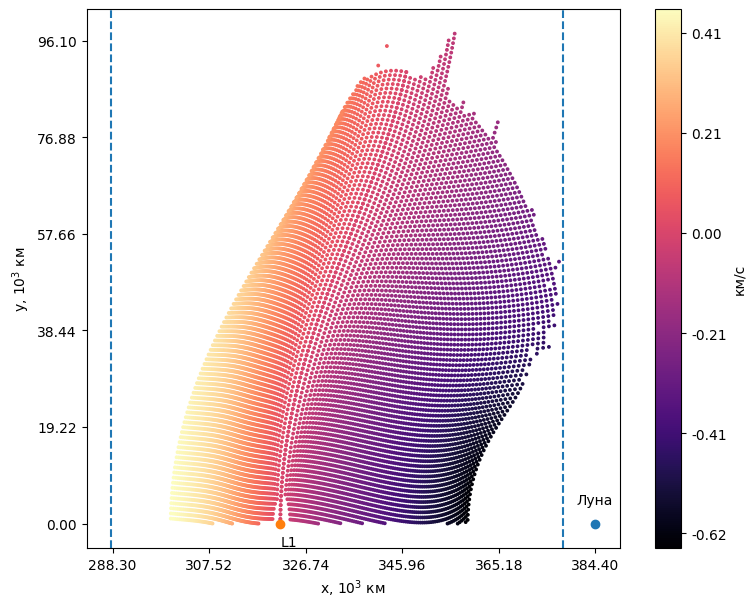

# Репозиторий для моей [дипломной работы](https://www.hse.ru/edu/vkr/1046120667)

В репозитории реализованы два метода расчета квазипериодических орбит:
- Метод плоскостей (surfaces method) + метод коррекционных импульсов
- Метод поверхности вращения (spl_method - split lyapunov method - вращаем горизонтальные орбиты Ляпунова) + метод коррекционных импульсов
, а также разработаны алгоритмы построения карт начальных условий.

## Структура:
- [instruments](./instruments) Инструменты для работы методов и визуализации результатов
- [surfaces_method](./surfaces_method) Метод плоскостей
- [spl_method](./spl_method) Метод поверхности вращения
- [data](./data) Здесь хранятся все выходные данные и карты
  - [contour_points](./data/contour_points) 
  - [datasets](./data/datasets)
  - [dv_data](./data/dv_data)
  - [orbits](./data/orbits)
- [tutorials](./tutorials) Туториалы OrbiPy

## Функционал

В работе подразумеваются два типа данных: 
- contour_data => массив линий контура, состоящих из отдельных точек
  - вида: `[ [[x,y,z], [x,y,z], [x,y,z], ..., [x,y,z]], [[x,y,z], [x,y,z], [x,y,z], ..., [x,y,z]], ... ]`
- points_data => массив всех точек
  - вида: `[ [x,y,z], [x,y,z], [x,y,z], ... ]`

С contour_data легче работать, и этот по дефолту возвращается методами вычисления карт. points_data легче визуализировать (и он является numpy.array со всеми вытикающими)

В папке [instruments](./instruments) в файле [instruments/instruments.py](./instruments/instruments.py) реализованы функции визуализации карт начальных условий.
Примеры их применения, а также основные результаты исследования представлены в ноутбуке [instruments/initial_states_map_visualizer.ipynb](./instruments/initial_states_map_visualizer.ipynb):

```
from instruments import instruments
instruments.ism_contour_visualizer(data).show()
```

В папках [surfaces_method](./surfaces_method) и [spl_method](./spl_method) находятся ноутбуки с реализациями соответствующих методов и алгоритмы построения карт для них. Также там лежат `.py` файлы для работы на суперкомпьютере.

## Установка:

Python 3.12
`pip install -r requiremets.txt`

Для работы метода поверхности вращения требуется установить модифицированную версию библиотеки [OrbiPy](https://bitbucket.org/tka4nik03/orbipy/src/bugfix/) (ветка `bugfix`):
`pip install -e /<путь до репозитория>/orbipy`




